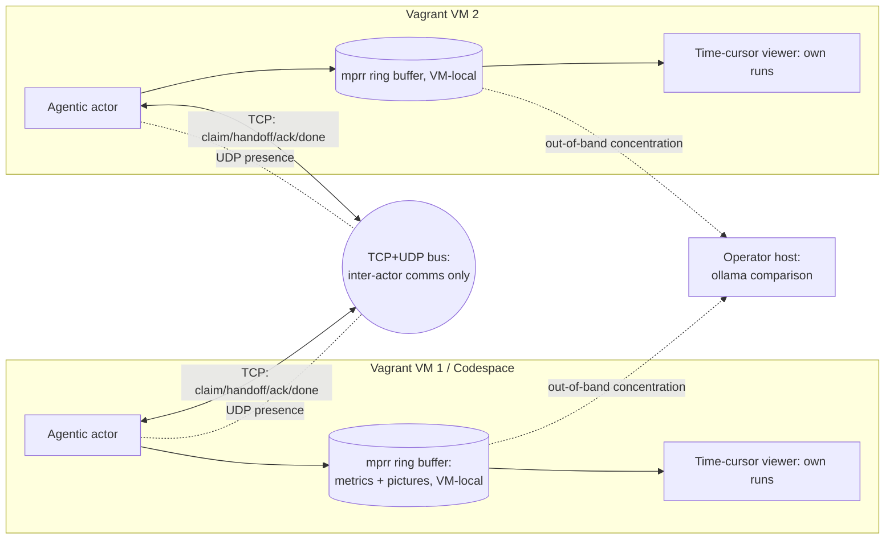

# labview-benchmark-actor — Architecture Description

> Standards baseline: `repo-standards-review` v0.2.19. Architecture description
> follows ISO/IEC/IEEE 42010 (stakeholders, concerns, viewpoints, views,
> architecture decisions). It covers the original plan and the capabilities
> since delivered, each traced to its requirements in the RTM.

## 1. Stakeholders and concerns (42010 §5.3)

| Stakeholder | Concern |
| --- | --- |
| Benchmark operator | Run benchmarks and review metric+picture evidence together over time |
| Extension maintainer | Clean extraction boundary from `vi-history-suite`; reproducible builds |
| Golden-VM / infra owner | Reproducible multi-VM provisioning; safe, offline coordination |
| Standards reviewer | Requirements→architecture→test traceability, enforced as a fail-closed 42010 correspondence graph; stamped baseline |
| Distributed-CI / cleanroom actor | Delegate uplift to a capability-matched AI provider over the bus; gate each outcome deterministically |
| Release manager | Bidirectional WIN↔LINUX sign-off before any shared-component publish; GitFlow governance on the release path |

## 2. Context view

`labview-benchmark-actor` is extracted from `vi-history-suite` (LBA-REQ-001) and
installed on a Codespace or Vagrant golden VM (LBA-REQ-002). It runs benchmarks
via its agentic actor (LBA-REQ-003), presents them in a time-cursor viewer
(LBA-REQ-004/005), and coordinates across multiple VMs over a TCP/UDP bus
(LBA-REQ-006/007) instead of a GitHub Discussion. The bus carries **inter-actor
communication only**; run data (metrics + pictures) stays VM-local in **mprr**'s
ring buffer (LBA-REQ-009). Agents review only their **own** previous runs; the
operator concentrates runs to the host for an **ollama** comparison layer
(LBA-REQ-010).

The **context diagram** below places the actor in its operational environment
(the Vagrant VMs / Codespace, the coordination bus, and the operator host):

## 3. Viewpoints and views (42010 §5.5–5.6)

The subsections below realize the four standard architecture views (the C4 /
42010 convention): the **context view** is the §2 context diagram (the system
in its environment); the **container view** is §3.1 (packaging) plus §3.2
(deployment) — the deployable `.vsix`, the VM-local mprr ring-buffer store, and
the coordination bus as the runtime containers; the **component view** is
§3.3–§3.5 — the actor / run-result, viewer, and coordination-transport
components inside those containers; and the **deployment view** is §3.2 — the
multi-VM / Codespace topology.

### 3.1 Packaging / boundary view — addresses LBA-REQ-001, LBA-REQ-008
- The extension is a self-contained `.vsix`. Reused `vi-history-suite` logic is
  vendored or a pinned published dependency — never a relative path.
- A moved-module manifest records the extraction so the origin can be retired.

### 3.2 Deployment view — addresses LBA-REQ-002, LBA-REQ-006, LBA-REQ-033, LBA-REQ-038
- One artifact, two install targets (Codespace, Vagrant golden VM).
- A declarative topology spawns N VMs, each activating the extension with a
  unique participant identity; teardown is clean.
- **Personal golden-VM onboarding (LBA-REQ-033):** a one-command `lba init`
  provisions a from-scratch Ubuntu 24.04 (Noble) VM, installs LabVIEW 2026
  Community Edition + VIPM from the NI apt repo, has the member activate
  interactively, then **confirms activation with a headless probe VI**
  (`LabVIEWCLI`) and mints a **local** personal golden VM registered as a mesh
  actor (ADR-0023). `LabVIEWCLI -Headless` is the actor runtime.
- **Activation confirmation, delivered (LBA-REQ-038):** the confirmation step is
  realized first — a headless **known-answer probe** (`LabVIEWCLI RunVI` on the
  shipped `AddTwoNumbers.vi`) must return the expected sum for the install to
  count as activated. The result is a deterministic `activation-receipt@1` whose
  digest covers only the verdict-bearing fields, so a committed **real** capture
  (LabVIEW 2026, 20 + 22 = 42) replays offline in CI and fails closed on any
  un-activated signal.

### 3.3 Actor / run-result view — addresses LBA-REQ-003, LBA-REQ-009
- The agentic actor drives a run and emits a **schema-versioned run result**:
  an ordered metric time-series and an ordered set of captured pictures, all on
  one run clock. This schema is the contract between actor and viewer.
- Captured pictures are stored **VM-locally** in mprr's ring buffer
  (long-packet), indexed via short-packet; the run result carries frame `ref`s
  into that local store, never image bytes (ADR-0005, LBA-REQ-009).

### 3.4 Viewer view — addresses LBA-REQ-004, LBA-REQ-005
- A single **selected-time** value is the source of truth. The draggable
  vertical cursor writes it; the chart and the picture panel below read it.
- Pictures are indexed by run-relative timestamp for O(log n) nearest-at-or-
  before resolution; the panel shows the indexed frame or an explicit
  "no frame" state.
- The viewer operates over the actor's **own** previous runs (local mprr
  store); there is no cross-VM comparison (LBA-REQ-010, ADR-0006).

### 3.5 Coordination-transport view — addresses LBA-REQ-007
- **TCP** carries reliable, ordered coordination (claim / handoff / ack / done /
  progress / note) preserving the GitHub-Discussion collab semantics
  (check-before-publish, one owner per hotspot).
- **UDP** carries presence/liveness (and a coordination time reference); it is
  **not** used for run comparison, since runs are never compared across VMs
  (ADR-0006).
- Messages are schema-versioned with sender id, timestamp, and session id; a
  late joiner reconstructs session state from the TCP log.
- The bus carries **inter-actor communication only** (claim/handoff/ack/done/
  note); it never carries run data, run/frame metadata, or images — the entire
  mprr ring buffer stays VM-local (ADR-0005, LBA-REQ-009).

### 3.6 Analysis view — addresses LBA-REQ-010, LBA-REQ-011, LBA-REQ-014, LBA-REQ-015, LBA-REQ-032
- Resource-usage correlation folds CPU/RAM/disk samples onto the benchmark frame
  timeline on a shared epoch-ms axis and, anchored on a trigger instant, computes
  a pre/post-trigger window (count, mean, min, max, delta) per metric — so a
  run's machine cost is readable against its own frames (LBA-REQ-011).
- Mesh-stress performance-signature calibration extracts a per-actor signature
  (the repetitive + outlier features of the 42-counter series across repeated
  runs), fits a stress-ladder calibration curve (rung → expected value + tolerance
  band, scored monotone/separable/repeatable), and inverse-reads an observed
  signature to an inferred stress level (LBA-REQ-032).
- Cross-plane comparison ingests the same mprr short-packet input on each plane
  (LINUX, WIN), stores a plane-local run, and compares a shared `benchmarkId`:
  the deterministic `seriesHash` MUST match across planes (substrate-independent
  correctness); the per-plane screenshot hash is a visual witness (LBA-REQ-014).
- A VI Analyzer run over the repo VIs is summarized into a deterministic,
  order-independent result (pass/fail/error counts + per-VI findings + a
  `resultHash`), making a static-analysis run a cross-plane-comparable benchmark
  (LBA-REQ-015).

### 3.7 Agentic-infrastructure view — addresses LBA-REQ-012, LBA-REQ-013, LBA-REQ-018, LBA-REQ-019
- The `lbabus` binary embeds version-pinned agent base instructions and exposes
  them via `lbabus agents` (print / --out / --check), so every session on a given
  version shares byte-identical, hardenable base instructions (LBA-REQ-012).
- The bus carries a priority tier (P0>P1>P2>P3) and an explicit addressee as
  additive flat-scalar fields that keep the `vihs-collab-msg@v1` schema, with
  `--to-me` / `--min-priority` reader filters, so triage never breaks older
  clients (LBA-REQ-013).
- Uplift / documentation tasks are delegated to a capability-matched cleanroom AI
  provider over the bus; the provider seam is agnostic (ollama / copilot-cli /
  codex / mock), outcomes are gated deterministically, and a receipt is announced
  as an ADR-0003 `DONE` frame (LBA-REQ-018, ADR-0011).
- The actor exposes its tools (host capabilities, benchmark series, bus
  poll / post) to a coding agent through a Model Context Protocol server
  (LBA-REQ-019, ADR-0012).

### 3.8 Configuration-management & assurance view — addresses LBA-REQ-016, LBA-REQ-017, LBA-REQ-020, LBA-REQ-021, LBA-REQ-022, LBA-REQ-030, LBA-REQ-034, LBA-REQ-035, LBA-REQ-036, LBA-REQ-037
- GitFlow branch governance (`main` protected + `develop` integration;
  feature / release / hotfix; SemVer tags on main; coverage retained on the
  release path) satisfies the repo-standards-review CM gate without weakening the
  CI-owned protected-main publish authority (LBA-REQ-016, ADR-0010).
- Every LabVIEW authoring-lane dependency is a version-pinned entry in a governed
  dependency manifest, so the authoring build is reproducible (LBA-REQ-017).
- A shared-component release is blocked until both the WIN and LINUX planes record
  an agreed sign-off for that exact version (LBA-REQ-020).
- Traceability is enforced as a 42010 correspondence graph: every governed test
  corresponds to ≥1 requirement (fail-closed), with the ADR↔requirement and
  requirement↔view rules promoted to fail-closed as the registers reconcile
  (LBA-REQ-021, ADR-0013).
- The bounded ISO/IEC/IEEE 26514 information-for-users product set is kept complete
  and command-covering by a fail-closed gate — a required item missing or a
  contributed command left undocumented blocks the build — under an explicit
  conformance boundary (LBA-REQ-034, ADR-0024).
- The requirement traceability matrix (`docs/requirements/traceability-matrix.md`)
  is generated from the canonical sources rather than hand-maintained, so the
  requirement → view → decision → test view stays current by construction
  (LBA-REQ-022, ADR-0013).
- The executed **test report** (ISO/IEC/IEEE 29119-3) and the **configuration
  status accounting** record (ISO 10007 / ISO/IEC/IEEE 12207) are generated from
  the verification apparatus into `docs/testing/test-report.md`, so the recorded
  outcomes and controlled state cannot drift from the gates, correspondence rules,
  requirements, and decisions they describe (LBA-REQ-035, ADR-0025).
- The signed, corroborated **release procedure** (ISO/IEC/IEEE 15289 procedure;
  12207 / ISO 10007 release process) is a first-class information item
  (`docs/release/release-procedure.md`) whose cited workflows, scripts, and
  release invariants are kept resolvable by a fail-closed gate, so the procedure
  cannot rot away from the apparatus it directs (LBA-REQ-036, ADR-0026).
- The repository **self-audits** its five-lens standards posture (REQ/ARCH/TEST/
  CM/DOC) at clause-evidence granularity and generates a scorecard
  (`docs/compliance/compliance-posture.md`); a fail-closed gate asserts 25/25 at
  target, so full standards compliance is verified continuously and cannot
  silently regress (LBA-REQ-037, ADR-0027).

### 3.9 Corroboration-grid view — addresses LBA-REQ-023, LBA-REQ-024, LBA-REQ-025, LBA-REQ-026, LBA-REQ-027, LBA-REQ-028, LBA-REQ-029, LBA-REQ-031

The Actor Corroboration Grid (ADR-0014) corroborates a component release across
independent, heterogeneous witnesses. Each witness — initially a Codespace-Linux node,
the VirtualBox-Linux cleanroom, and the Windows plane — builds `lbabus` from the same
source@commit, self-certifies via the shared gate-suite, renders the deterministic
viewer, and emits a signed receipt bundle. A majority (≥2 of 3) must agree on the
OS-independent anchors (viewer `seriesHash`, `lbabus` version + `sourceCommit`,
gate-suite `verdict`) — the Linux subset additionally on the pinned `pngSha256` and the
Ubuntu codename — for the quorum to permit the release; a sub-majority blocks it and
opens a divergence issue (LBA-REQ-023, ADR-0014). The quorum arithmetic (a graded majority
over tiered anchors, LBA-REQ-024, ADR-0015), the signed provenance chain verified before
consumption (LBA-REQ-025, ADR-0016), and the enforced witness independence (distinct enrolled
environments, LBA-REQ-026, ADR-0017) refine this view. The reviewer station and human sign-off
(LBA-REQ-027, ADR-0018), the mesh verdict beacon (LBA-REQ-028, ADR-0019), and the agent-facing
MCP orchestration surface (LBA-REQ-029, ADR-0020) complete it. Provenance is published to a signed,
append-only Merkle transparency log (RFC 6962) and the reviewer station verifies a release's corroboration
chain is attested and logged before installing it (verify-before-install, LBA-REQ-031, ADR-0022).

## 4. Architecture decisions (42010 §5.7)

| AD | Decision | Rationale | Traces to |
| --- | --- | --- | --- |
| AD-1 | Extract as a standalone extension, not a fork | Clean boundary; independent release cadence | LBA-REQ-001 |
| AD-2 | One artifact, two install targets | Reproducible benchmarking baseline on Codespace and VM | LBA-REQ-002 |
| AD-3 | Single schema-versioned run-result contract | Decouples actor from viewer; enables reproducibility checks | LBA-REQ-003 |
| AD-4 | Single selected-time source of truth | Guarantees cursor↔picture synchronization | LBA-REQ-004/005 |
| AD-5 | TCP for order, UDP for presence/liveness (advisory time) | Reliability where needed, low latency where tolerable | LBA-REQ-007 |
| AD-6 | Loopback / private-network bind by default | Offline, air-gapped, no public exposure | LBA-REQ-007 |
| AD-7 | Mirror the collab-bus semantics on the new transport | Preserve a proven coordination model across a transport change | LBA-REQ-007 |
| AD-8 | Store all run data in the VM-local mprr ring buffer; bus carries inter-actor comms only | Reuse the absorbed mprr model's governed bounded-RAM ring buffer; keep the bus data-agnostic; cleanroom isolation | LBA-REQ-009 |
| AD-9 | No cross-VM comparison; concentrate runs to the host for an ollama layer | Preserve cleanroom isolation; improve comparison on one concentrated corpus | LBA-REQ-010 |
| AD-10 | Own the mprr ring/timing model in-repo (absorbed, dependency-free); retire the external `svelderrainruiz/mprr` dependency | Self-contained + testable in-repo; no outside schema to track; the `mprr` name is kept for the local model (ADR-0009) | LBA-REQ-003, LBA-REQ-005, LBA-REQ-009 |
| AD-11 | Correlate CPU/RAM/disk to the frame timeline with a trigger-anchored pre/post window | The resource cost of a benchmarked action is readable against its own run | LBA-REQ-011 |
| AD-12 | Embed version-pinned agent base instructions in the `lbabus` binary | Same version ⇒ byte-identical, hardenable base instructions across sessions | LBA-REQ-012 |
| AD-13 | Priority + addressee envelope on the bus, additive and back-read-compatible | Triage without breaking the `vihs-collab-msg@v1` schema for older clients | LBA-REQ-013 |
| AD-14 | Deterministic cross-plane benchmark compare (the `seriesHash`/`resultHash` must match; the screenshot is a witness) | Substrate-independent correctness across LINUX/WIN | LBA-REQ-014, LBA-REQ-015 |
| AD-15 | GitFlow branch governance (`main` protected + `develop` integration) | Passes the repo-standards CM gate without weakening CI publish authority (ADR-0010) | LBA-REQ-016 |
| AD-16 | Version-pin every LabVIEW authoring-lane dependency in a governed manifest | Reproducible authoring-lane build on the clean room | LBA-REQ-017 |
| AD-17 | Delegate validated uplift to a capability-matched cleanroom AI provider over the bus | Providers run where the licence/capability lives; the host observes gated outcomes (ADR-0011) | LBA-REQ-018 |
| AD-18 | Expose the actor's tools to agents via a Model Context Protocol server | A standard, agent-discoverable tool surface (ADR-0012) | LBA-REQ-019 |
| AD-19 | Bidirectional WIN↔LINUX sign-off gates every shared-component publish | Neither plane ships an unreviewed shared release | LBA-REQ-020 |
| AD-20 | Enforce a 42010 correspondence graph as fail-closed CI gates | Traceability that cannot silently rot (ADR-0013) | LBA-REQ-021 |
| AD-21 | Generate the requirement traceability matrix from the canonical sources rather than hand-maintaining it | A single derived, gated view that cannot drift from the SRS / RTM / architecture / ADRs (ADR-0013) | LBA-REQ-022 |
| AD-22 | Corroborate each component release via a multi-witness quorum (the Actor Corroboration Grid) | Independent cross-environment agreement raises release confidence and resists forgery (ADR-0014) | LBA-REQ-023 |
| AD-23 | Score the corroboration quorum as a graded majority over tiered anchors | Heterogeneous witnesses compose; one outage tolerated; divergence is actionable (ADR-0015) | LBA-REQ-024 |
| AD-24 | Sign and verify the whole corroboration provenance chain before consumption | No unattested release is installable; tamper-evidence is external (ADR-0016) | LBA-REQ-025 |
| AD-25 | Require distinct enrolled environments for a valid quorum | Agreement cannot be forged by cloning one environment (ADR-0017) | LBA-REQ-026 |
| AD-26 | Human sign-off is a separate gate atop the machine quorum, on a dual reviewer station | A subjective judgment complements but does not replace the deterministic quorum (ADR-0018) | LBA-REQ-027 |
| AD-27 | Witnesses beacon their verdicts over the lbabus mesh | Live, distributed verdict collection reusing the bus, no new transport (ADR-0019) | LBA-REQ-028 |
| AD-28 | Extend the MCP tool surface with grid-orchestration tools | One discoverable agent surface drives the grid (ADR-0020, ADR-0012) | LBA-REQ-029 |
| AD-29 | Non-release pull requests target develop, not main | Prevents the stale main-based pull-request class from dumping integration onto the release branch (ADR-0021, ADR-0010) | LBA-REQ-030 |
| AD-30 | Publish corroboration provenance to a signed Merkle transparency log and verify inclusion before install | Append-only, offline-verifiable provenance; no unattested or un-logged release is installable (ADR-0022, ADR-0016) | LBA-REQ-031 |
| AD-31 | One-command `lba init` provisions an Ubuntu 24.04 golden VM with LabVIEW 2026 CE + VIPM; a headless probe VI confirms activation; the VM is minted locally and registered as a mesh actor | From-scratch, reproducible Linux onboarding unlocks the OS comparison axis without a shared box registry (ADR-0023) | LBA-REQ-033, LBA-REQ-038 |
| AD-32 | Govern the bounded ISO/IEC/IEEE 26514 information-for-users set with a fail-closed completeness + command-coverage gate | Non-gated documentation drifts from the product; enforcing the bounded product set keeps user information current by construction (ADR-0024) | LBA-REQ-034 |
| AD-33 | Generate the 29119-3 test report + ISO 10007 status accounting from the verification apparatus and gate it fail-closed on drift | The repo recorded a test plan but never the executed outcomes or controlled configuration state; generating them from the enforced apparatus keeps assurance current by construction (ADR-0025) | LBA-REQ-035 |
| AD-34 | Make the signed, corroborated release procedure a first-class 15289 information item and gate its cited enforcement points + invariants fail-closed | The release flow was scattered across the CM plan and the grid requirements with no single procedure; gating it keeps the procedure resolvable and invariant-complete by construction (ADR-0026) | LBA-REQ-036 |
| AD-35 | Self-audit the five-lens standards posture at clause-evidence granularity and gate 25/25 fail-closed | The 25/25 audit was a point-in-time score; a generated, fail-closed self-audit makes full compliance corroborated by construction and closes F4 (non-gated conformance) for all standards (ADR-0027) | LBA-REQ-037 |

## 5. Risks and open questions

- `[Resolved ADR-0003]` Bus wire format — length-prefixed JSON over TCP.
- `[Resolved ADR-0004]` UDP presence/liveness + advisory coordination time
  (no cross-VM comparison).
- `[Open]` Picture capture *source* and cadence per target (host vs container
  vs LabVIEW render). **Storage is resolved (ADR-0005): the VM-local mprr ring
  buffer**, and the benchmark-frame → mprr-long-packet mapping is now
  **confirmed by a headless live capture** (20/20 frames, one long-packet
  payload per `frameId`, `driftClass=none`; see
  `experiments/mprr-live-capture/`). The remaining open is the capture
  source/cadence per target.
- `[Risk]` Extraction scope creep — the moved-module manifest (AD-1) must be
  bounded before implementation to avoid dragging `vi-history-suite` internals.

## 6. Decision records

Detailed decisions are recorded as ADRs in [adr/](adr/README.md):

| ADR | Resolves | Owner |
| --- | --- | --- |
| [ADR-0001](adr/ADR-0001-run-result-schema.md) | Run-result schema (metrics + time-indexed pictures on one clock) | WIN |
| [ADR-0002](adr/ADR-0002-viewer-cursor-picture-binding.md) | Viewer single selected-time source of truth | WIN |
| [ADR-0005](adr/ADR-0005-image-storage-mprr-ringbuffer-cleanroom.md) | Image/frame storage via mprr ring buffer in the VM cleanroom (no image transport) | WIN |
| [ADR-0006](adr/ADR-0006-run-concentration-ollama-comparison.md) | Run concentration to the host + ollama comparison (no cross-VM) | WIN |
| [ADR-0003](adr/ADR-0003-coordination-bus-wire-format.md) | Coordination-bus wire format (length-prefixed JSON over TCP) | LINUX |
| [ADR-0004](adr/ADR-0004-cross-vm-time-sync.md) | UDP presence/liveness + advisory coordination time (no cross-VM comparison) | LINUX |
| [ADR-0007](adr/ADR-0007-image-derived-timing-binary-strip.md) | Image-derived timing binds to the pixel-decoded binary strip (cross-platform) | WIN |
| [ADR-0008](adr/ADR-0008-interactive-ollama-drive-mirrored-build-coordination.md) | Interactive host-Ollama drive + mirrored build-coordination over `lbabus` | WIN |
| [ADR-0009](adr/ADR-0009-absorb-mprr-model-self-owned.md) | Absorb the mprr ring/timing model as self-owned (retire the external `svelderrainruiz/mprr`) | WIN |
| [ADR-0010](adr/ADR-0010-gitflow-branch-governance.md) | GitFlow branch governance (`main` protected + `develop` integration) | LINUX |
| [ADR-0011](adr/ADR-0011-provider-delegation-cleanroom-uplift.md) | AI-provider uplift delegated to cleanroom actors over the bus | LINUX |
| [ADR-0012](adr/ADR-0012-mcp-server-agent-tool-surface.md) | The actor's tools exposed to agents via a Model Context Protocol server | LINUX |
| [ADR-0013](adr/ADR-0013-enforced-42010-correspondence-graph.md) | Enforced ISO/IEC/IEEE 42010 correspondence graph as the traceability architecture | LINUX |
| [ADR-0014](adr/ADR-0014-actor-corroboration-grid.md) | Actor Corroboration Grid: multi-witness release corroboration | LINUX |
| [ADR-0015](adr/ADR-0015-corroboration-quorum-confidence.md) | Corroboration quorum + graded confidence | LINUX |
| [ADR-0016](adr/ADR-0016-provenance-attestation.md) | Provenance and attestation for the corroboration grid | LINUX |
| [ADR-0017](adr/ADR-0017-witness-independence.md) | Witness independence for the corroboration grid | LINUX |
| [ADR-0018](adr/ADR-0018-reviewer-station.md) | Reviewer station for the corroboration grid | LINUX |
| [ADR-0019](adr/ADR-0019-mesh-integration.md) | Mesh integration for the corroboration grid | LINUX |
| [ADR-0020](adr/ADR-0020-mcp-orchestration-surface.md) | MCP orchestration surface for the corroboration grid | LINUX |
| [ADR-0021](adr/ADR-0021-pull-requests-target-develop.md) | Pull requests target develop, not main | LINUX |
| [ADR-0022](adr/ADR-0022-transparency-log-inclusion.md) | Signed Merkle transparency log + verify-before-install | LINUX |
| [ADR-0023](adr/ADR-0023-personal-golden-vm-onboarding.md) | Personal golden-VM onboarding (Ubuntu + LabVIEW CE) for the community | LINUX |
| [ADR-0024](adr/ADR-0024-govern-26514-information-for-users.md) | Govern 26514 information for users as a fail-closed requirement | LINUX |

Remaining open items: the picture-capture *source*/cadence (storage itself is
resolved by ADR-0005) and the extraction-scope `[Risk]` (the bounded
moved-module manifest).
